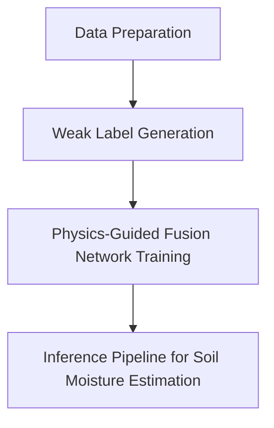

```mermaid
flowchart TD
    A["Data Preparation"] --> B["Weak Label Generation"]
    B --> C["Physics-Guided Fusion Network Training"]
    C --> D["Inference Pipeline for Soil Moisture Estimation"]
```